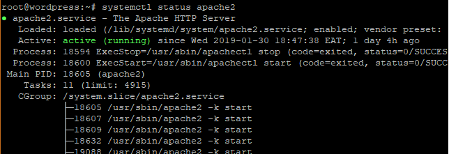
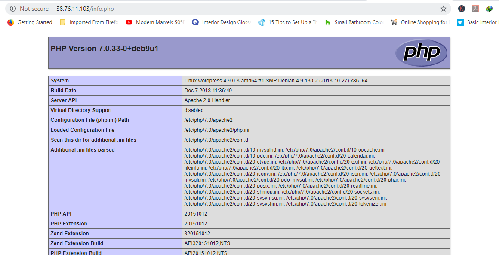

## Bash скрипт

Повністю самостійний bash скрипт

[wp.sh] (/wp.sh)

## Digital Ocean

`sudo su` - rootуємся :)

`apt update && apt upgrade` - оновлення пакетів

`apt install apache2` - Встановлення apache2

`systemctl status apache2` - перевірка apache



`ip addr / ifconfig` - дізнатися ip адресу

Далі потрібно перейти на заглушку apache, якщо ви все правильно зробили має відкритись така сторінка.

`http://ip-address`


`apt install mariadb-server mariadb-client` - встановлюємо mysql сервер

`mysql_secure_installation` - налаштування сервера

1. Зміна пароля root для входу в БД (N)
2. Видалення анонімних користувачів (Y)
3. Заборона віддаленого підключення (Y)
4. Видалення шаблону (Y)
5. Перезавантаження БД (Y)

`apt install php php-mysql` - Встановлення PHP

`nano /var/www/html/info.php` - Створення файлу з інформацією

Якщо nano не встановлений `apt install nano`

```
<?php
phpinfo();
?>
```

Щоб перевірити що php встановився перейдіть за адресою:

`http://ip-address/info.php`

Якщо відкрилася сторінка з інформацією про php можемо продовжувати



`mysql -u root -p` - вхід в mysql

**Mysql command:**

`CREATE DATABASE wordpress_db;` - worrdpress_db назва БД

`CREATE USER 'wp_user'@'localhost' IDENTIFIED BY 'password';` - Створення нового користувача password пароль до БД

`GRANT ALL ON wordpress_db.* TO 'wp_user'@'localhost' IDENTIFIED BY 'password';` - права

`FLUSH PRIVILEGES;
Exit;` - вихід

`cd ~ && mkdir tmp` - створення тимчасової папки

`cd /tmp && wget [https://wordpress.org/latest.tar.gz](https://wordpress.org/latest.tar.gz)` - завантаження актуальної версії Wordpress

`tar -xvf latest.tar.gz` - розпаковуємо архів

`cp -R wordpress /var/www/html/` - копіюємо файли в папку apache

`chown -R www-data:www-data /var/www/html/wordpress/` - права

`chmod -R 755 /var/www/html/wordpress/` - права

`mkdir /var/www/html/wordpress/wp-content/uploads` - створюємо каталог завантаження

`chown -R www-data:www-data /var/www/html/wordpress/wp-content/uploads/`- права

**Продовження тут:**

`https://server-ip/wordpress`

[Інструкція на DigitalOcean](https://www.digitalocean.com/community/tutorials/install-wordpress-on-ubuntu)
